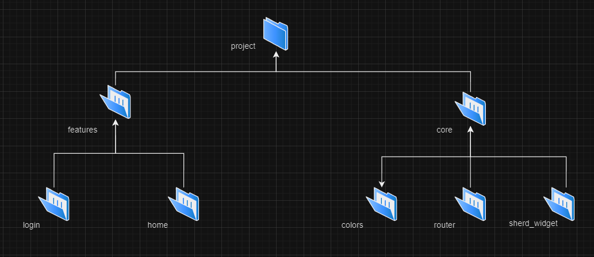
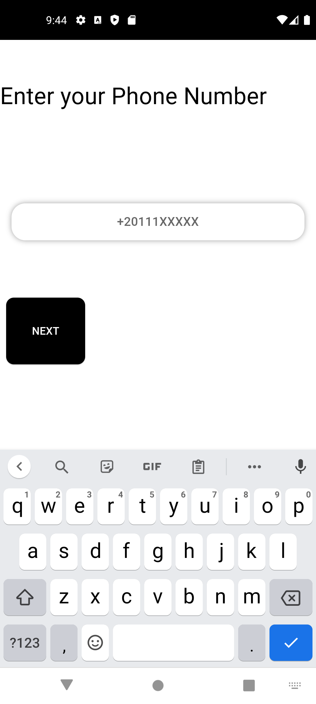
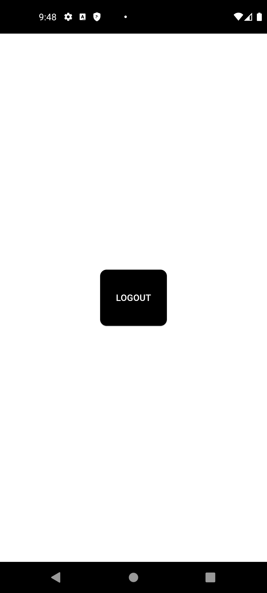

## login_using_phone_v2

# This project is just a simple training application on how to organize project folders, packages, and code, manage screen states, build and modify it in the future, and integrate several projects into it.

# project folders

# step1

# project step2

# project step3

